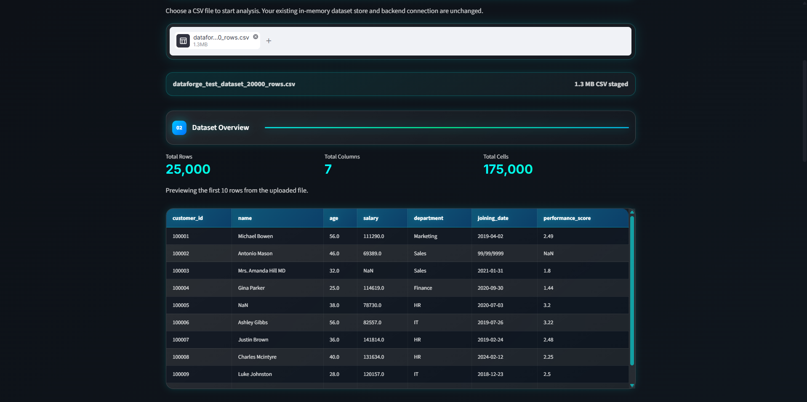
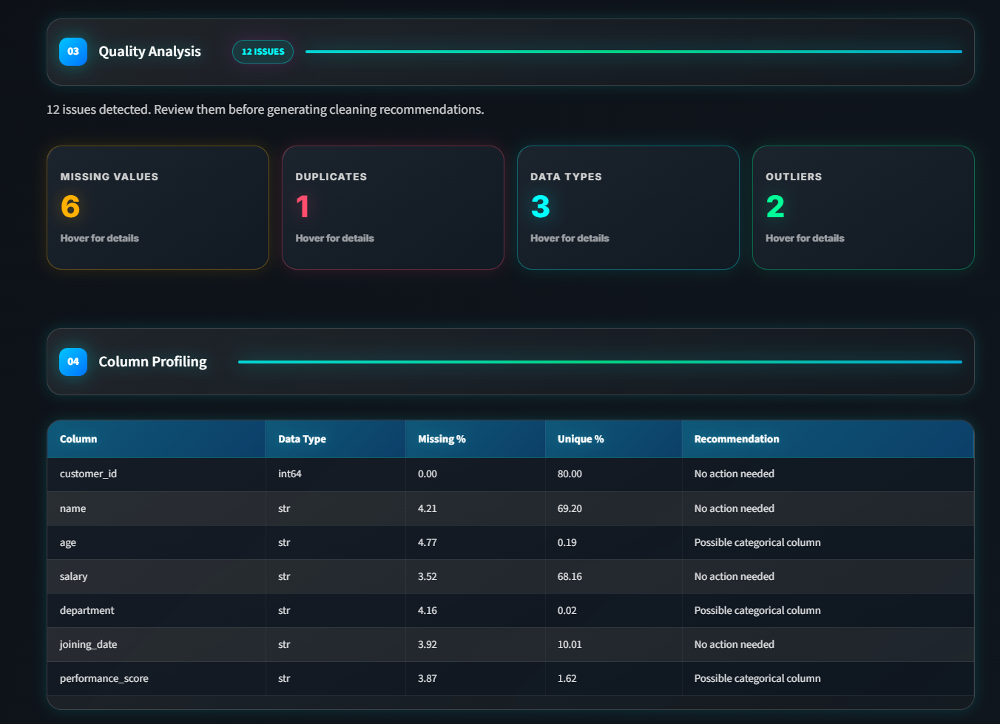
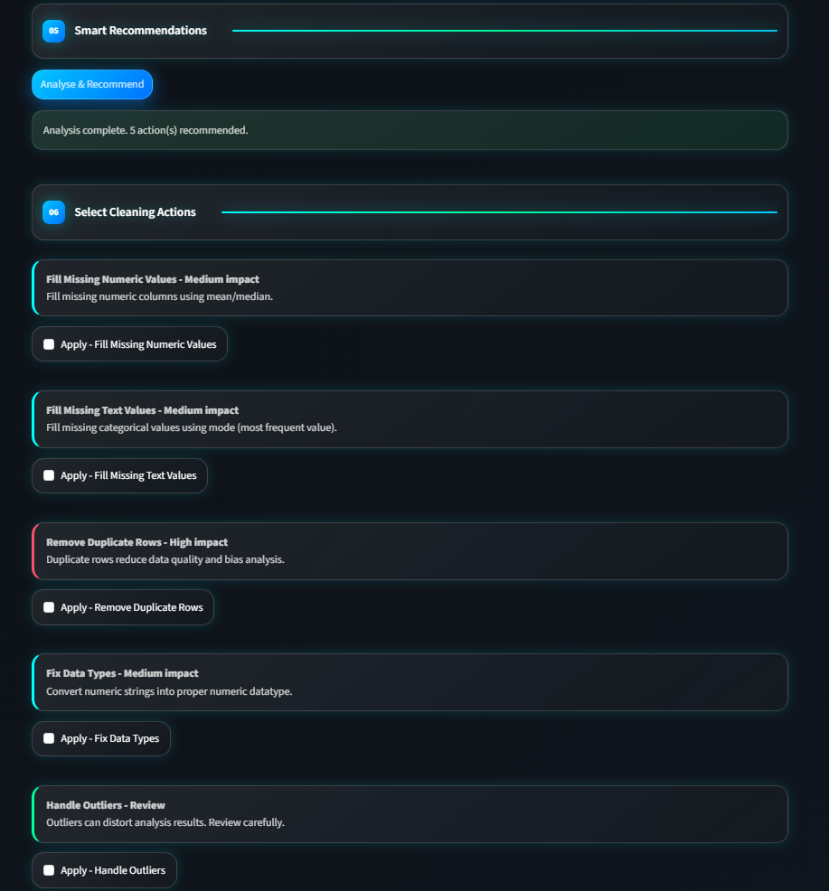

# DataForge — Data Quality & Profiling Platform

> A production-style Data Quality & Profiling Platform built using Streamlit, FastAPI, and Pandas that automates dataset validation, quality assessment, profiling, and one-click cleaning workflows for CSV and Excel datasets.

---

## 🌐 Live Demo

👉 **Live Application:** https://dataforge-upgoxxngpjptfws5s9feky.streamlit.app/

## 📌 Problem Statement

Data analysts spend a significant amount of time cleaning and validating datasets before they can begin analysis. Missing values, duplicate records, datatype inconsistencies, and outliers often lead to inaccurate reporting, unreliable dashboards, and poor business decisions.

DataForge solves this challenge by providing an automated data quality workflow that:

* Profiles uploaded datasets instantly
* Detects quality issues automatically
* Generates actionable cleaning recommendations
* Enables one-click remediation workflows
* Maintains an audit trail of cleaning actions

The platform accelerates data preparation and improves dataset reliability before analytics or reporting.

---

## 🏗️ Architecture

```text
CSV / Excel Dataset
        ↓
Upload Layer
(Streamlit Frontend)
        ↓
Dataset Preview Engine
        ↓
Data Profiling Layer
├── Missing Value Analysis
├── Duplicate Detection
├── Datatype Validation
└── IQR Outlier Detection
        ↓
FastAPI Recommendation Service
        ↓
Cleaning Engine
├── Fill Missing Values
├── Remove Duplicates
├── Fix Datatypes
└── Handle Outliers
        ↓
Clean Dataset Output
        ↓
Audit Trail & Reporting
```

---

## 🏗️ Architecture

[Architecture section here]

---

## 📸 Dashboard Preview

### Dataset Overview



### Quality Analysis



### Cleaning Recommendations



---

## 📁 Project Structure

```text
dataforge/
│
├── app.py
├── api.py
├── cleaner.py
├── profiler.py
├── store.py
│
├── screenshots/
│   ├── dashboard_overview.png
│   ├── quality_analysis.png
│   └── cleaning_recommendations.png
│
├── requirements.txt
├── README.md
└── .gitignore
```

---

## 🔧 Tech Stack

| Layer               | Technology         |
| ------------------- | ------------------ |
| Frontend            | Streamlit          |
| Backend API         | FastAPI            |
| Data Processing     | Python             |
| Data Analysis       | Pandas             |
| Numerical Computing | NumPy              |
| API Communication   | Requests           |
| File Support        | CSV, Excel (.xlsx) |
| Data Validation     | Custom Rule Engine |

---

## 🚀 Core Features

### Dataset Upload

* Upload CSV datasets
* Upload Excel (.xlsx) datasets
* Automatic schema detection
* Instant dataset preview

### Data Profiling

* Row and column statistics
* Missing value analysis
* Unique value analysis
* Datatype inspection
* Column-level recommendations

### Data Quality Assessment

Automated detection of:

* Missing values
* Duplicate records
* Datatype inconsistencies
* Statistical outliers

### Rule-Based Recommendation Engine

The FastAPI service converts detected quality issues into actionable recommendations.

Examples:

* Fill missing numeric values
* Fill missing categorical values
* Remove duplicate rows
* Fix datatype mismatches
* Review outliers

### One-Click Cleaning Actions

Users can directly execute recommended actions:

* Fill missing numeric values using mean imputation
* Fill missing categorical values using mode imputation
* Remove duplicate records
* Convert text values into numeric datatypes
* Prepare datasets for downstream analysis

### Audit Trail

Tracks cleaning operations performed on the dataset, ensuring transparency and traceability.

---

## 📊 Data Quality Checks

### Missing Value Detection

Detects null values across all columns and calculates the percentage impact on the dataset.

### Duplicate Detection

Identifies duplicate records that can distort analytical results and reporting accuracy.

### Datatype Validation

Detects text values present in expected numeric fields and recommends datatype corrections.

### Outlier Detection

Uses the Interquartile Range (IQR) method to identify unusually high or low values that may impact analysis.

### Column Profiling

For every column, the platform generates:

* Data Type
* Missing Percentage
* Unique Percentage
* Recommended Action

---

## 📸 Dashboard Preview

### Dataset Overview


### Quality Analysis


### Cleaning Recommendations


---

## ⚙️ Workflow

### Step 1 — Upload Dataset

Upload a CSV or Excel file through the Streamlit interface.

### Step 2 — Generate Profile

The profiling engine analyzes:

* Dataset structure
* Missing values
* Duplicate records
* Datatype issues
* Statistical outliers

### Step 3 — Review Quality Issues

The platform summarizes detected issues in an interactive dashboard.

### Step 4 — Generate Recommendations

The FastAPI recommendation engine maps detected issues to actionable cleaning workflows.

### Step 5 — Execute Cleaning Actions

Apply recommended actions directly from the interface.

### Step 6 — Export Clean Dataset

Use the cleaned dataset for reporting, dashboarding, analytics, or machine learning workflows.

---

## 🎯 Technical Challenges Solved

### Dynamic Dataset Profiling

Built a profiling engine capable of analyzing uploaded datasets without requiring predefined schemas.

### Rule-Based Recommendation Engine

Developed a FastAPI recommendation service that translates quality issues into actionable cleaning operations.

### Automated Cleaning Workflow

Designed one-click remediation actions that transform profiling insights into executable data preparation steps.

### Modular Architecture

Separated profiling, cleaning, recommendation, and storage logic into independent modules to improve maintainability and scalability.

---

## 📈 Key Outcomes

* Automated dataset profiling workflows
* Reduced manual data validation effort
* Improved dataset consistency and reliability
* Accelerated data preparation processes
* Enabled self-service data quality assessment

---

## 💼 Business Value

| Challenge             | DataForge Solution                 |
| --------------------- | ---------------------------------- |
| Poor data quality     | Automated quality assessment       |
| Manual data cleaning  | One-click cleaning workflows       |
| Hidden anomalies      | Outlier detection engine           |
| Inconsistent schemas  | Datatype validation and correction |
| Slow data preparation | Automated profiling pipeline       |

---

## 🚀 Getting Started

### Clone Repository

```bash
git clone https://github.com/your-username/dataforge.git
cd dataforge
```

### Install Dependencies

```bash
pip install -r requirements.txt
```

### Run Streamlit Application

```bash
streamlit run app.py
```

### Run FastAPI Backend

```bash
uvicorn api:app --reload
```

### Access Application

Streamlit UI:

```text
http://localhost:8501
```

FastAPI API:

```text
http://127.0.0.1:8000
```

Interactive API Documentation:

```text
http://127.0.0.1:8000/docs
```

---

## 📡 API Example

### Request

```json
{
  "issues": [
    "Column 'salary' has missing values",
    "Duplicate rows found",
    "Column 'age' has datatype issues"
  ]
}
```

### Response

```json
{
  "recommendations": [
    {
      "title": "Fill Missing Numeric Values",
      "action": "fill_missing_mean"
    },
    {
      "title": "Remove Duplicate Rows",
      "action": "remove_duplicates"
    },
    {
      "title": "Fix Data Types",
      "action": "fix_dtypes"
    }
  ],
  "total_actions": 3
}
```

---

## 🎯 Interview Talking Points

### Q: What business problem does DataForge solve?

*"Data analysts often spend more time preparing data than analyzing it. DataForge automates profiling, validation, and cleaning workflows, reducing manual effort and improving data quality before analytics begins."*

### Q: Why use Streamlit and FastAPI together?

*"Streamlit provides a fast analytics-focused frontend, while FastAPI exposes profiling and recommendation services through scalable API endpoints. This separation allows the UI and business logic to evolve independently."*

### Q: What was the most technically challenging part?

*"Designing a recommendation engine that converts detected data quality issues into actionable cleaning workflows while keeping the user experience simple and intuitive."*

### Q: How are outliers detected?

*"The platform uses the Interquartile Range (IQR) method, calculating lower and upper bounds using Q1, Q3, and 1.5×IQR to identify unusually high or low observations."*

---

## 🔮 Future Enhancements

* AI-powered cleaning recommendations
* Data quality scoring framework
* PDF profiling reports
* Database connectivity (MySQL, PostgreSQL, SQL Server)
* Data lineage tracking
* Workflow scheduling
* Role-based access control
* Cloud deployment support

---

## 👤 Author

**Vaibhav Talekar**

Data Analyst | BI Developer

LinkedIn: https://www.linkedin.com/in/vaibhav-talekar-37056224b

Portfolio: https://vaibhav-portfolio-indol-three.vercel.app/
